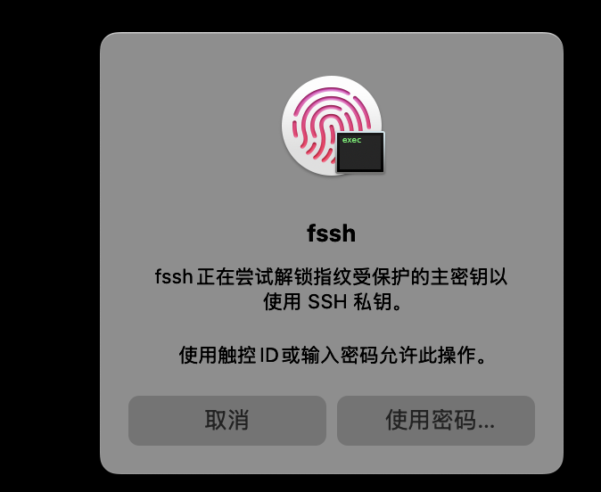
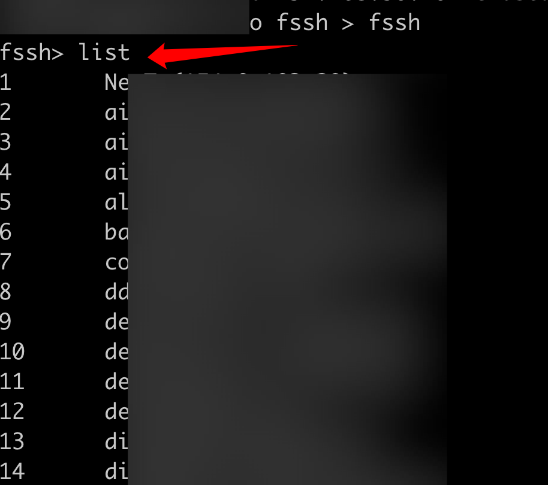

# fssh - 让 SSH 登录更简单安全



## 这是什么？

fssh 是一个 macOS 专用的 SSH 密钥管理工具，解决两个痛点：

1. **每次 SSH 登录都要输入私钥密码** → fssh 让你用指纹（Touch ID）或一次性验证码（OTP）解锁
2. **记不住 `~/.ssh/config` 里配置的服务器别名** → fssh 提供交互式界面，Tab 补全，快速连接

## 工作原理

```
┌─────────────┐     ┌─────────────┐     ┌─────────────┐
│  SSH 客户端  │ ──▶ │  fssh Agent │ ──▶ │  远程服务器  │
└─────────────┘     └─────────────┘     └─────────────┘
                          │
                    Touch ID 或 OTP
                    解锁加密的私钥
```

你的 SSH 私钥被加密存储，只有通过 Touch ID 指纹或 OTP 验证后才能解密使用。

## 功能截图

**SSH 登录时弹出指纹验证：**


**交互式 Shell 查看和连接服务器：**



---

## 快速开始

### 方式一：交互式设置向导（推荐）

最简单的开始方式 - 一条命令搞定所有配置：

```bash
# 编译项目
go build ./cmd/fssh

# 运行交互式设置向导
./fssh init
```

向导会引导你完成：
1. **选择认证模式** - Touch ID 或 OTP
2. **安装二进制文件** - 自动复制 fssh 到 /usr/local/bin
3. **导入 SSH 密钥** - 扫描并导入 ~/.ssh/ 下的密钥
4. **配置开机自启** - 设置 LaunchAgent 自动启动
5. **启动 agent** - 立即启动 fssh agent
6. **配置 SSH 客户端** - 自动更新 ~/.ssh/config

完成后，你就可以直接使用 SSH 并通过 Touch ID/OTP 认证了！

### 方式二：手动设置（进阶）

适合希望逐步控制每个环节的用户：

#### 第一步：安装

```bash
# 下载源码后，编译
go build ./cmd/fssh

# 安装到系统目录（需要管理员权限）
sudo cp fssh /usr/local/bin/
```

#### 第二步：初始化

根据你的设备选择认证模式：

**如果你的 Mac 有 Touch ID（MacBook Pro/Air 2016年后、iMac 配 Magic Keyboard 等）：**

```bash
fssh init --mode touchid
```

**如果你的 Mac 没有 Touch ID（Mac Mini、老款 Mac、虚拟机等）：**

```bash
fssh init --mode otp
```

OTP 模式初始化时会：
1. 让你设置一个密码（至少 12 位）
2. 显示 TOTP 密钥，需要添加到手机的验证器 App（如 Google Authenticator、Authy）
3. 显示 10 个恢复码，**请务必保存好**

#### 第三步：导入 SSH 私钥

```bash
# 导入你的 SSH 私钥（如果私钥有密码，会提示输入）
fssh import --alias mykey --file ~/.ssh/id_rsa --ask-passphrase
```

参数说明：
- `--alias`：给这个密钥起个名字，方便记忆
- `--file`：私钥文件路径
- `--ask-passphrase`：如果私钥有密码保护，加上这个参数

#### 第四步：启动 Agent

```bash
fssh agent
```

启动后，Agent 会在后台运行，监听 `~/.fssh/agent.sock`。

#### 第五步：配置 SSH 使用 fssh Agent

编辑 `~/.ssh/config` 文件，在**最开头**添加：

```
Host *
    IdentityAgent ~/.fssh/agent.sock
```

这样所有 SSH 连接都会通过 fssh Agent。

#### 第六步：开始使用

```bash
# 正常使用 SSH 命令，会自动弹出 Touch ID 或要求输入 OTP
ssh user@yourserver.com
```

---

## 交互式设置向导详解

交互式向导（`fssh init`）会执行以下步骤：

### 详细流程

**步骤 1：欢迎和初始化检查**
- 显示欢迎横幅
- 检查是否已经初始化过
- 如果需要重新初始化，会提示确认

**步骤 2：选择认证模式**
- 自动检测你的 Mac 是否支持 Touch ID
- 提示选择：
  - Touch ID（推荐用于支持的设备）
  - OTP（适用于不支持 Touch ID 的设备或需要额外安全性）

**步骤 3：执行认证初始化**
- 执行所选认证模式的设置
- Touch ID 模式：生成主密钥并存储到 macOS 钥匙串
- OTP 模式：设置密码 + TOTP，生成恢复码

**步骤 4：安装二进制文件**
- 检测当前可执行文件位置
- 复制 fssh 到 `/usr/local/bin/`（需要 sudo）
- 设置正确的权限（755）

**步骤 5：导入 SSH 密钥**
- 扫描 `~/.ssh/` 目录查找私钥
- 检测标准密钥文件：`id_rsa`、`id_ed25519`、`id_ecdsa` 等
- 识别加密和未加密的密钥
- 逐个提示导入：
  - 建议的别名（例如 `id_ed25519` → `ed25519`）
  - 如果密钥加密，提示输入密码
- 使用加密保护导入密钥

**步骤 6：配置 LaunchAgent**
- 在 `~/Library/LaunchAgents/com.fssh.agent.plist` 创建 plist 文件
- 加载 LaunchAgent 实现登录时自动启动
- 配置 agent 持续运行

**步骤 7：启动 Agent**
- 等待 agent 启动（最多 10 秒）
- 验证 `~/.fssh/agent.sock` 的 socket 连接

**步骤 8：配置 SSH 客户端**
- 提示更新 `~/.ssh/config`
- 修改前创建备份
- 在开头添加 `IdentityAgent` 配置以实现 SSH 自动集成

### 非交互模式

适用于自动化、脚本或 CI/CD：

```bash
# 跳过所有交互式提示
fssh init --non-interactive --mode touchid

# 或直接指定模式
fssh init --mode otp
```

---

## 设置开机自启动

每次开机后手动启动 Agent 太麻烦？设置自启动：

```bash
# 复制启动配置文件
cp contrib/com.fssh.agent.plist ~/Library/LaunchAgents/

# 加载服务
launchctl load -w ~/Library/LaunchAgents/com.fssh.agent.plist
```

**检查服务状态：**

```bash
launchctl list | grep fssh
```

正常输出类似：`-    0    com.fssh.agent`（0 表示正在运行）

**如果需要重启服务：**

```bash
launchctl kickstart -k gui/$(id -u)/com.fssh.agent
```

**如果需要停止服务：**

```bash
launchctl unload ~/Library/LaunchAgents/com.fssh.agent.plist
```

---

## 交互式 Shell 使用

直接运行 `fssh` 或 `fssh shell` 进入交互模式：

```bash
$ fssh
fssh> list                    # 列出 ~/.ssh/config 中的所有主机
fssh> search prod             # 搜索包含 "prod" 的主机
fssh> connect myserver        # 连接到 myserver
fssh> myserver                # 也可以直接输入主机名连接
fssh> exit                    # 退出
```

支持 **Tab 补全**，输入部分主机名后按 Tab 自动补全。

---

## 常用命令一览

### 初始化命令

| 命令 | 说明 |
|------|------|
| `fssh init` | 交互式设置向导（推荐） |
| `fssh init --interactive` | 显式运行交互式向导 |
| `fssh init --mode touchid` | 使用 Touch ID 初始化（非交互式） |
| `fssh init --mode otp` | 使用 OTP 初始化（非交互式） |
| `fssh init --non-interactive --mode touchid` | 非交互模式，适用于脚本/CI |

### 密钥管理

| 命令 | 说明 |
|------|------|
| `fssh import --alias 名字 --file 路径 --ask-passphrase` | 导入私钥 |
| `fssh list` | 列出已导入的密钥 |
| `fssh export --alias 名字 --out 路径` | 导出密钥（备份） |
| `fssh remove --alias 名字` | 删除密钥 |

### Agent 和 Shell

| 命令 | 说明 |
|------|------|
| `fssh agent` | 启动 Agent |
| `fssh status` | 查看状态 |
| `fssh shell` | 进入交互式 Shell |

---

## 配置文件

配置文件位置：`~/.fssh/config.json`

```json
{
    "socket": "~/.fssh/agent.sock",
    "require_touch_id_per_sign": true,
    "unlock_ttl_seconds": 600,
    "log_level": "info",
    "log_format": "plain"
}
```

**配置项说明：**

| 配置项 | 说明 | 默认值 |
|--------|------|--------|
| `socket` | Agent 监听的 socket 路径 | `~/.fssh/agent.sock` |
| `require_touch_id_per_sign` | 是否每次 SSH 签名都验证（安全模式） | `true` |
| `unlock_ttl_seconds` | 验证后的缓存时间（秒），缓存期内无需重复验证 | `600`（10分钟） |
| `log_level` | 日志级别：`debug`/`info`/`warn`/`error` | `info` |
| `log_format` | 日志格式：`plain`（易读）/`json`（结构化） | `plain` |

**安全模式 vs 便捷模式：**

- `require_touch_id_per_sign: true`（安全模式）：每次 SSH 连接都需要验证（或在 TTL 缓存期内免验证）
- `require_touch_id_per_sign: false`（便捷模式）：启动时一次性解密所有密钥，之后无需验证

---

## 常见问题

### 1. 报错 "incorrect signature type" 或 "no mutual signature supported"

**原因**：SSH 客户端没有通过 fssh Agent，或服务器不支持 RSA-SHA2。

**解决方法**：
1. 确认 Agent 正在运行：`launchctl list | grep fssh`
2. 确认 `~/.ssh/config` 配置了 `IdentityAgent ~/.fssh/agent.sock`
3. 或设置环境变量：`export SSH_AUTH_SOCK=~/.fssh/agent.sock`

### 2. 输入后没有显示（光标不动）

**原因**：终端控制问题。

**解决方法**：使用 `ssh -tt` 强制分配 TTY：

```bash
ssh -tt user@server
```

### 3. launchctl load 报错 "Load failed: 5: Input/output error"

**原因**：服务已经加载过，或未完成初始化。

**解决方法**：

```bash
# 先卸载
launchctl unload ~/Library/LaunchAgents/com.fssh.agent.plist

# 确保已初始化
fssh init --mode touchid  # 或 otp

# 重新加载
launchctl load -w ~/Library/LaunchAgents/com.fssh.agent.plist
```

### 4. OTP 验证码总是错误

**原因**：手机时间不同步，或添加 TOTP 时信息有误。

**解决方法**：
1. 确保手机时间正确（开启自动设置时间）
2. 删除验证器中的旧条目，重新添加
3. 如果实在无法恢复，使用恢复码

### 5. 忘记 OTP 密码怎么办？

如果保存了恢复码，可以用恢复码重置。如果没有恢复码，只能重新初始化（会丢失已导入的密钥）：

```bash
# 警告：这会删除所有已导入的密钥！
rm -rf ~/.fssh
fssh init --mode otp
# 然后重新导入密钥
```

---

## 安全说明

1. **私钥加密存储**：导入的私钥使用 AES-256-GCM 加密，即使电脑被盗，没有 Touch ID/OTP 也无法解密
2. **推荐启用 FileVault**：macOS 全盘加密，提供额外保护
3. **不要泄露恢复码**：OTP 模式的恢复码相当于万能钥匙，请妥善保管
4. **定期备份密钥**：使用 `fssh export` 备份重要密钥

---

## 技术细节

- **加密算法**：AES-256-GCM + HKDF（每个密钥文件独立 salt/nonce）
- **密钥派生**：PBKDF2（100,000 次迭代）
- **TOTP 标准**：RFC 6238
- **兼容性**：完全兼容 OpenSSH ssh-agent 协议

---

## 致谢

本项目由 TRAE AI 软件辅助生成。
